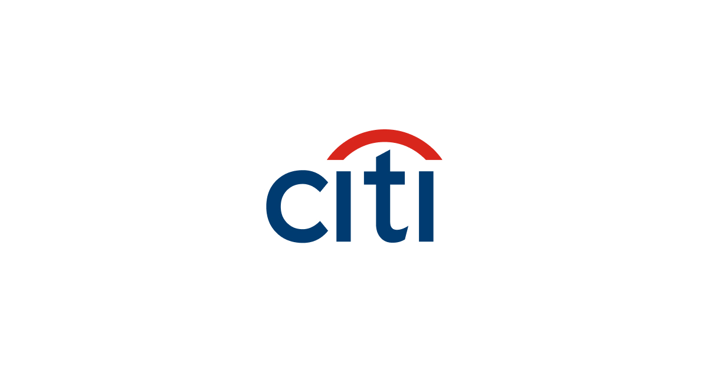
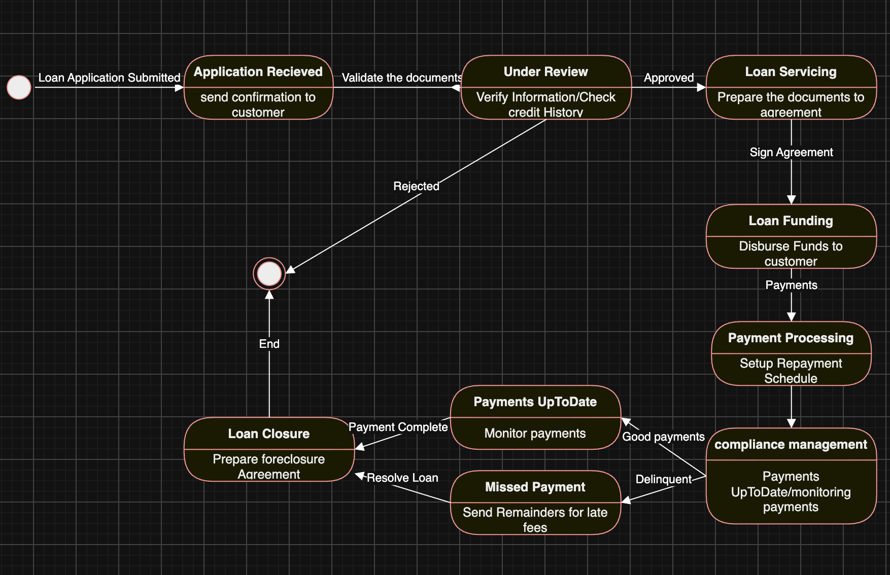

<p align="center">
  
</p>

<h1 align="center">Citi Technology Software Development Simulation</h1>


# Tech Stack

**Languages:** Java, Python
**APIs:** REST API, Twelve Data API  
**Data:** Pandas, Queue Data Structures, Time-Series Data  
**Visualization:** Matplotlib  
**Modeling:** UML, System Design  
**Domain:** Credit-Risk Analysis

---

# Loan Management State Diagram

The first task focused on modeling the lifecycle of a loan management system using a UML state diagram.

The objective was to identify the different states a loan can move through, the events that trigger transitions between states, and the actions performed during those transitions.



---

# Credit Risk Modeling

This task focused on designing a technical approach for a credit-risk modeling system.

The solution considered:

* Customer and financial data
* Credit-risk factors
* Data preparation
* Risk assessment
* Model inputs and outputs
* System architecture
* Data quality
* Explainability of risk decisions

A credit-risk system needs reliable input data and clearly defined processing stages so that the resulting assessment can be understood and reviewed.

### Concepts:

* Credit-risk analysis
* Data modeling
* System design
* Risk assessment
* Technical architecture
* Data-quality considerations
* Business-to-technical requirement translation

---

# Real-Time Market Data Collection

This task involved building a Java application that retrieves market data from the **Twelve Data API**.

The application monitors the **DIA ETF**, retrieves its latest price periodically, attaches a timestamp to each observation, and stores the resulting data points in a queue.

### Processing Flow

```text
Twelve Data API
       ↓
   HTTP Request
       ↓
  Latest DIA Price
       ↓
Add Timestamp
       ↓
  Queue Storage
       ↓
Market Data Stream
```

### Implementation

The Java application:

1. Loads the Twelve Data API key from an environment variable.
2. Sends a request to the Twelve Data API.
3. Retrieves the latest DIA price.
4. Records the observation timestamp.
5. Adds the price and timestamp to a queue.
6. Repeats the process at approximately 15-second intervals.

### Technologies

* Java
* REST API
* Twelve Data API
* HTTP requests
* Queue data structure
* Timestamped market data
* Environment variables

The implementation was tested using Java 21.

---

# Market Data Visualization

This task focused on visualizing the market data collected by the Java application.

The Java output containing price observations and timestamps was parsed using Python and converted into a structured dataset before generating a time-series line chart.

### Processing Flow

```text
Java Market Data Output
          ↓
       Python
          ↓
    Parse Price Data
          ↓
    Parse Timestamps
          ↓
      Pandas DataFrame
          ↓
    Matplotlib Line Chart
```

### Implementation

The Python visualization:

1. Reads the market-data output.
2. Extracts prices using pattern matching.
3. Extracts timestamps.
4. Converts the extracted information into a Pandas DataFrame.
5. Converts timestamps into datetime values.
6. Generates a line chart showing price observations over time.

### Technologies

* Python
* Pandas
* Matplotlib
* Regular expressions
* Time-series data processing
* Data visualization
---

---


